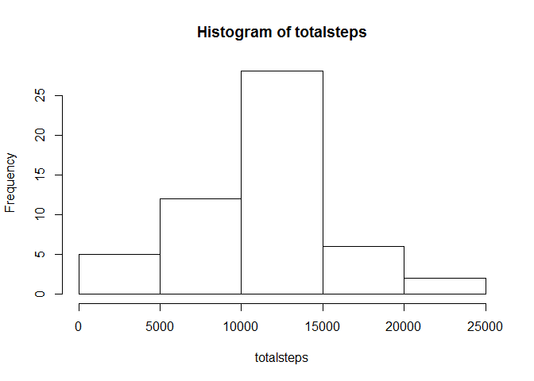
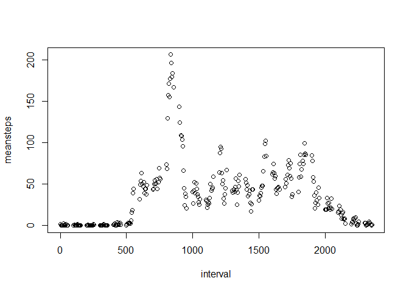
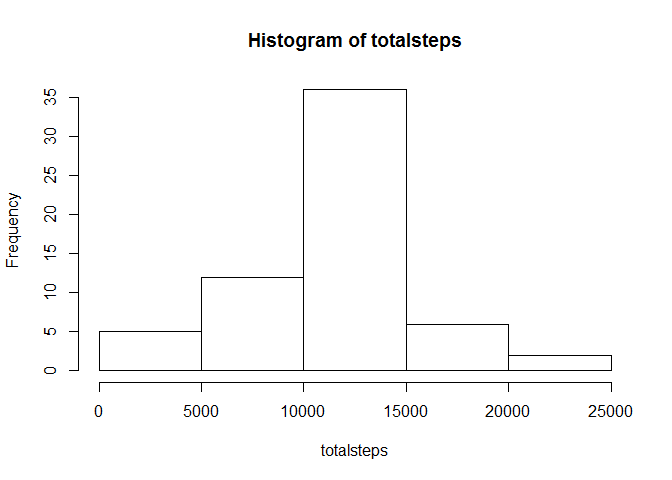
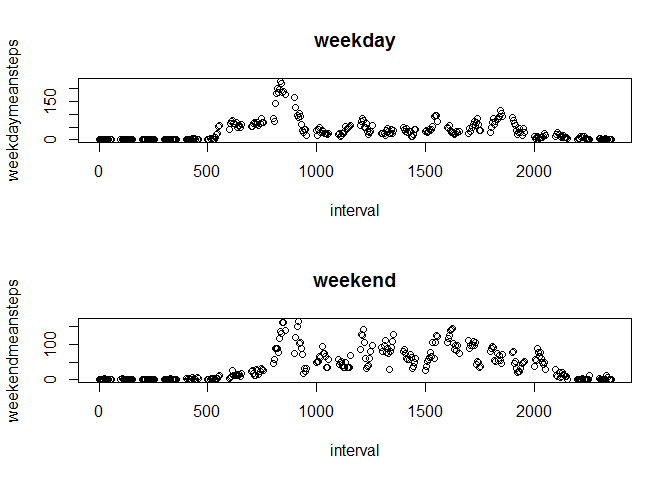

# Reproducible Research: Peer Assessment 1


## Loading and preprocessing the data

```r
options(max.print=999999)
data <- read.csv("activity.csv") 
data <- as.data.frame(data) 
```
## What is mean total number of steps taken per day?
1. Calculate the total number of steps taken per day

```r
totalsteps <- with(data,tapply(steps,date,sum))
```

2. Make a histogram of the total number of steps taken each day

```r
hist(totalsteps)
```

 

3. Calculate and report the mean and median of the total number of steps taken per day

```r
meansteps <- mean(totalsteps,na.rm=TRUE)
meansteps
```

```
## [1] 10766.19
```

```r
mediansteps <- median(totalsteps,na.rm=TRUE)
mediansteps
```

```
## [1] 10765
```

## What is the average daily activity pattern?
1. Make a time series plot

```r
meansteps <- with(data,tapply(steps,interval,mean, na.rm=TRUE))
interval <- as.numeric(levels(as.factor(data$interval)))
plot(interval,meansteps)
```

 

2. Which 5-minute interval contains the maximum number of steps?

```r
maxinterval <- interval[which(meansteps==max(meansteps))]
maxinterval
```

```
## [1] 835
```

## Imputing missing values
1. Calculate and report the total number of missing values in the dataset

```r
numofNA <- sum(is.na(data$steps))
numofNA
```

```
## [1] 2304
```

2. Replace NAs with the mean of that 5-min interval

```r
tmp <- rep(meansteps,length(levels(data$date)))
```

3. Create a new dataset that is equal to the original dataset but with the missing data filled in

```r
indexNA <- is.na(data$steps)
data$steps[indexNA] <- tmp[indexNA]
```

4. Repeat part I and compare

```r
totalsteps <- with(data,tapply(steps,date,sum))
hist(totalsteps)
```

 

```r
meansteps <- mean(totalsteps,na.rm=TRUE)
meansteps
```

```
## [1] 10766.19
```

```r
mediansteps <- median(totalsteps,na.rm=TRUE)
mediansteps
```

```
## [1] 10766.19
```
- With NA replaced by the mean value of each 5 minutes interval, we can see that more mass are added near the mean and the mean and median are the same now. 

## Are there differences in activity patterns between weekdays and weekends?
1. Create a new factor variable in the dataset with two levels - "weekday" and "weekend".

```r
tmp <- as.factor(weekdays(as.Date(data$date)))
levels(tmp)
```

```
## [1] "Friday"    "Monday"    "Saturday"  "Sunday"    "Thursday"  "Tuesday"  
## [7] "Wednesday"
```

```r
levels(tmp) <- c(rep("weekday",2),rep("weekend",2),rep("weekday",3));
levels(tmp)
```

```
## [1] "weekday" "weekend"
```

2. Make a panel plot containing a time series plot 

```r
data2 <- split(data,tmp)
weekdaydata <- data2[["weekday"]]
weekdaymeansteps <- with(weekdaydata,tapply(steps,interval,mean, na.rm=TRUE))
weekenddata <- data2[["weekend"]]
weekendmeansteps <- with(weekenddata,tapply(steps,interval,mean, na.rm=TRUE))
par(mfcol = c(2,1))
plot(interval,weekdaymeansteps, main="weekday")
plot(interval,weekendmeansteps, main="weekend")
```

 


